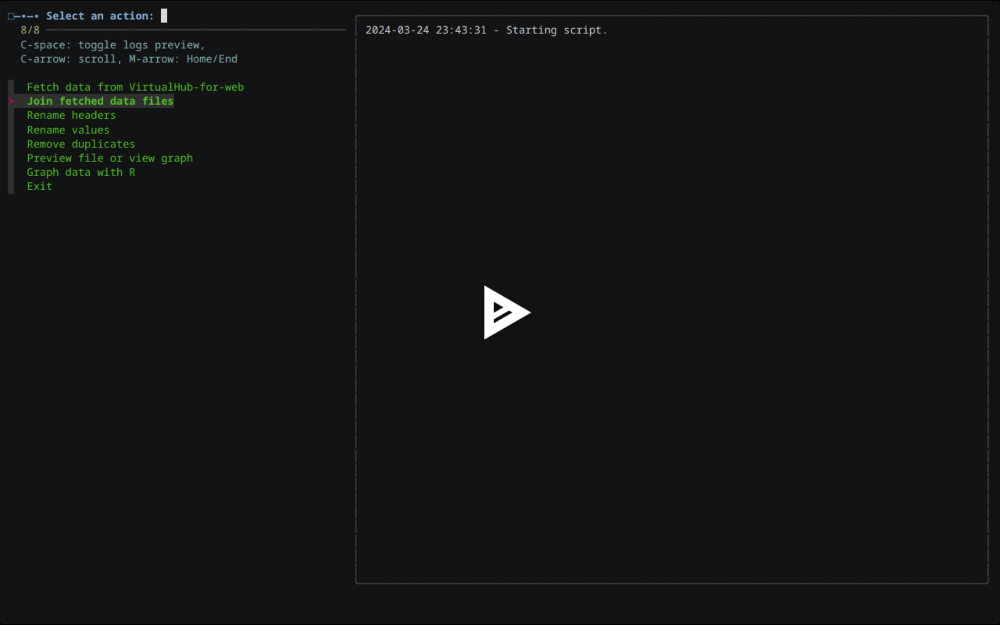
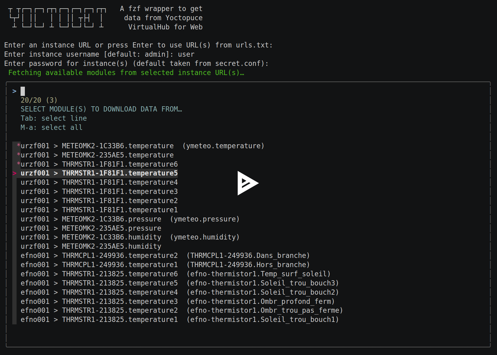
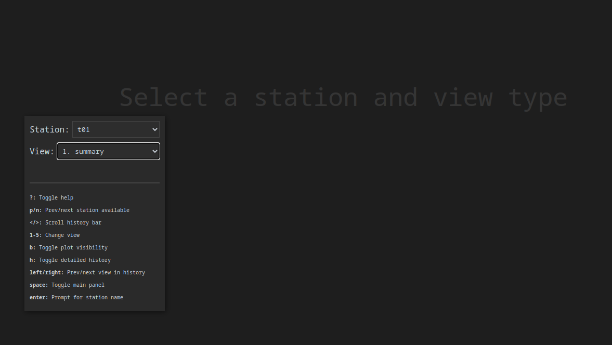
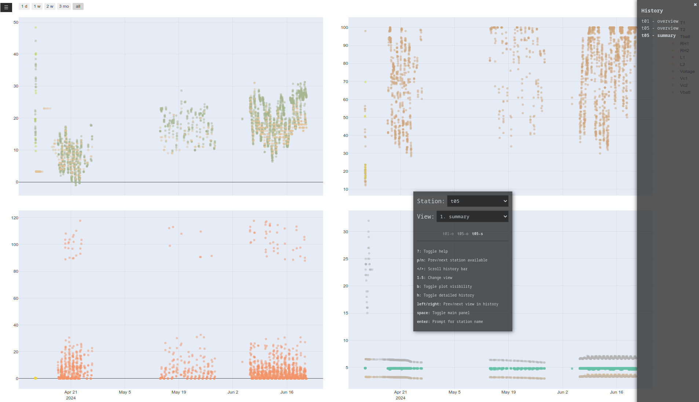

[](https://asciinema.org/a/649213)

[](https://asciinema.org/a/8uMlxGa7KWx3HxRTz8YIeyByW)

# yoctofzf

`yoctofzf` needs a description. It is a Bash script to ease operations on csv files collected from Yoctopuce modules, in particular those connected to a VirtualHub-for-web: fetching, joining csv files from multiple sensors, selecting and renaming columns, replacing values, removing duplicates, viewing files, sending data files through any processing R pipelines (one example is provided to generate plots, but the script accepts new pipelines).

The interactive mode (powered by `fzf`) should be fully functional. The non-interactive mode, with run-time options and arguments to automate batch operations, isn't written yet.

## Dependencies

- `fzf`
- `awk`
- optional: `bat` (beware that on Debian, the `bat` binary is actually called `batcat`, meaning you may need to run `sudo ln -s $(which batcat) /usr/bin/bat` for `yoctofzf` to find it)
- optional: `r-base` (the name of the package may change depending on the distribution, check `R` and `r-core` too).
- optional: _R_ packages to be installed within _R_ with `install.packages(c("data.table", "dplyr", "ggplot2", "htmlwidgets", "lubridate", "magrittr", "plotly", "viridis", "wesanderson"))`; each of these packages may have their own compiling dependencies; typically the distribution package `libcurl4-openssl-dev` or its variant in your distribution may be required

## Usage

The script should already be executable (else, do `chmod +x /path/to/yoctofzf`). Run it with `sh /path/to/yoctofzf`, `./yoctofzf`, `/path/to/./yoctofzf`.

The script is organized into submenus for each of the main functions that you can navigate to or from using the arrows on the keyboard, or Enter and Escape. Upon selecting a function, you will be prompted to select station, sensors and data files to complete the actions. A preview panel on the right on the script will be displayed by default to show either the tree of the files in the directory you are browsing, or the content of the data files, depending on context. When at the root of the script, where the main functions can be selected, the preview shows a history logs of all actions taken, which will persist across sessions.

To be completed.

# Yocto viewer

`Yocto viewer` is an html page (`index.thml` in this repository) which you can open and bookmark to ease navigating through all the plots you may have generated for all your stations using `yoctofzf` and the _R_ pipelines:





# yoctoget

```
 ┬ ┬┌─┐┌─┐┌┬┐┌─┐┌─┐┌─┐┌┬┐   A fzf wrapper to get
 └┬┘│ ││   │ │ ││ ┬├┤  │     data from Yoctopuce
  ┴ └─┘└─┘ ┴ └─┘└─┘└─┘ ┴      VirtualHub for Web
```

`yoctoget` is a simple `fzf` wrapper written in Bash for the `YSensor` binary from [Yoctopuce's command line API](https://www.yoctopuce.com/EN/libraries.php) (and only that binary, for now) to ease retrieving in batch the data from remote [VirtualHub for Web](https://www.yoctopuce.com/EN/article/nouveau-un-virtualhub-qui-fonctionne-a-travers-le-web) instances. It allows storing URLs to VirtualHub for Web instances already used in the past to quickly select from them upon the next execution. Although not recommended, the user can store their favourite VirtualHub for Web instance password in `secret.conf`.

`yoctoget` can be called from within `yoctofzf`, or as a standalone. `yoctoget` is an unofficial script, unaffiliated to Yoctopuce SARL, and comes with no warranty whatsoever.

## Dependencies

- `YSensor` (either downloaded from [yoctopuce.com](https://www.yoctopuce.com/EN/libraries.php) or, for apt-based distributions, from the Yoctopuce APT repository)
- `fzf`
- `awk`
- `pv`

The `YSensor` binary should be in your `$PATH` (typically `~/.local/bin/` or `/usr/bin/`), else `yoctoget` will not find it.

## Usage

The script should already be executable (else, do `chmod +x /path/to/yoctoget`), then run it with `sh /path/to/yoctoget`, `./yoctoget`, `/path/to/./yoctoget`, or using the "Fetch" function in `yoctofzf` above, then follow the instructions.

Downloaded data will be stored in `data/<instancename>/` subdirectories, like so:

```
data
├── bob001
│   ├── THRMCPL1-249936.temperature1_(THRMCPL1-249936.Some_custom_name)_all.csv
│   ├── THRMCPL1-249936.temperature2_(THRMCPL1-249936.Some_other_name)_all.csv
│   ├── THRMSTR1-213825.temperature1_(bob-thermistor.Blah_blah)_all.csv
│   ├── THRMSTR1-213825.temperature2_(bob-thermistor.This_is_thermistor2)_all.csv
│   ├── THRMSTR1-213825.temperature3_(bob-thermistor.This_is_thermistor3)_all.csv
│   ├── THRMSTR1-213825.temperature4_(bob-thermistor.This_is_thermistor4)_all.csv
│   ├── THRMSTR1-213825.temperature5_(bob-thermistor.This_is_thermistor5)_all.csv
│   └── THRMSTR1-213825.temperature6_(bob-thermistor.This_is_thermistor6)_all.csv
└── alice001
    ├── METEOMK2-1C33B6.humidity_(ymeteo.humidity)_from_2023-06-02.csv
    ├── METEOMK2-1C33B6.pressure_(ymeteo.pressure)_from_2023-06-02.csv
    ├── METEOMK2-1C33B6.temperature_(ymeteo.temperature)_from_2023-06-02.csv
    ├── METEOMK2-235AE5.humidity_from_2023-06-02.csv
    ├── METEOMK2-235AE5.pressure_from_2023-06-02.csv
    ├── METEOMK2-235AE5.temperature_from_2023-06-02.csv
    ├── THRMSTR1-1F81F1.temperature1_from_2023-06-02.csv
    ├── THRMSTR1-1F81F1.temperature2_from_2023-06-02.csv
    ├── THRMSTR1-1F81F1.temperature3_from_2023-06-02.csv
    ├── THRMSTR1-1F81F1.temperature4_from_2023-06-02.csv
    ├── THRMSTR1-1F81F1.temperature5_from_2023-06-02.csv
    └── THRMSTR1-1F81F1.temperature6_from_2023-06-02.csv

3 directories, 20 files
```
